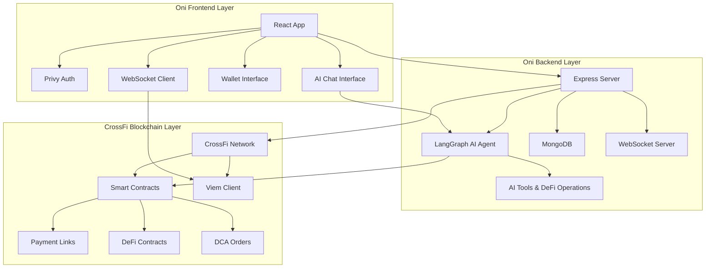
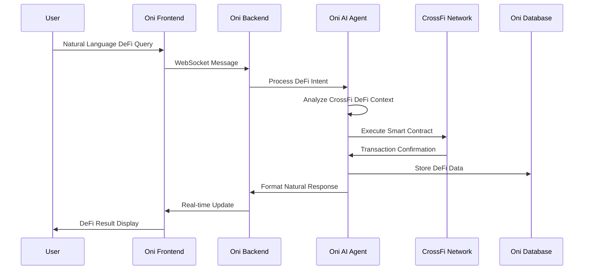

# Oni - AI Agent Platform for CrossFi DeFi

> **If you can prompt, you can DeFi**

Oni is a revolutionary AI agent platform that enables users to participate in DeFi on CrossFi blockchain through natural language processing. Our mission is to democratize access to CrossFi DeFi by making complex blockchain operations as simple as having a conversation with an AI agent.

## 🚀 Vision

We envision a world where anyone who can use natural language can participate in DeFi on CrossFi blockchain. Oni serves as the bridge between human intent and smart contract execution, making complex DeFi operations accessible through simple conversations with AI agents.

## 🎯 Problem Statement

### The DeFi Accessibility Challenge

**Complex Smart Contract Interactions**: Traditional DeFi platforms require users to understand complex technical concepts, smart contract interactions, and blockchain mechanics. This creates a significant barrier for non-technical users who want to participate in DeFi on CrossFi.

**Steep Learning Curve**: Users must learn specialized interfaces, understand gas fees, slippage, liquidity pools, and other DeFi concepts. This learning curve prevents mainstream adoption of CrossFi DeFi applications.

**High Risk of User Errors**: Manual transaction execution leaves room for costly mistakes - wrong addresses, incorrect amounts, failed transactions, and lost funds due to user error.

**Limited Natural Language Integration**: Current DeFi tools don't leverage natural language processing, forcing users to adapt to technical interfaces rather than having the technology adapt to human communication patterns.

### Market Opportunity

**Growing CrossFi Ecosystem**: The CrossFi blockchain is rapidly expanding with new DeFi protocols, creating demand for accessible tools that can bridge the gap between technical complexity and user-friendly experiences.

**AI-Powered DeFi Gap**: While AI has transformed many industries, DeFi remains largely manual and technical. There's a significant opportunity to integrate AI agents that can understand and execute DeFi operations through natural language.

**Democratization of DeFi**: There's a clear need for platforms that can make CrossFi DeFi accessible to the 99% of users who don't have technical backgrounds but want to participate in the financial revolution.

## 🛠️ Oni Solution Architecture

### High-Level System Design



### Oni AI Agent Architecture

```mermaid
graph LR
    subgraph "User Input"
        A[Natural Language Query] --> B[Intent Recognition]
    end
    
    subgraph "Oni AI Processing"
        B --> C[LangGraph Agent]
        C --> D[DeFi Tool Selection]
        D --> E[Parameter Extraction]
        E --> F[CrossFi Chain Validation]
    end
    
    subgraph "DeFi Execution"
        F --> G[Smart Contract Interaction]
        G --> H[Transaction Execution]
        H --> I[CrossFi Network Confirmation]
    end
    
    subgraph "User Response"
        I --> J[Natural Language Response]
        J --> K[Real-time UI Update]
        K --> L[Transaction History Update]
    end
```



### Oni Data Flow Architecture



## 🏗️ Oni Technical Stack

### Frontend
- **Framework**: React 18 + TypeScript
- **Styling**: Tailwind CSS + Custom Alien Tech Theme
- **Authentication**: Privy (Web3 Auth)
- **State Management**: React Hooks + Context API
- **Real-time**: Socket.IO Client
- **Blockchain**: Viem + CrossFi RPC
- **AI Interface**: Natural Language Chat

### Backend
- **Runtime**: Node.js + Express
- **AI Framework**: LangGraph (Multi-Agent System)
- **Database**: MongoDB + Mongoose
- **Real-time**: Socket.IO Server
- **Blockchain**: Viem + Ethers.js
- **Authentication**: Privy Integration
- **NLP**: Advanced Natural Language Processing

### CrossFi Blockchain
- **Network**: CrossFi Mainnet/Testnet
- **Smart Contracts**: Solidity + Hardhat
- **Tokens**: XFI, MPX, USDC
- **Explorer**: xfiscan.com
- **DeFi Protocols**: Payment Links, DCA

## 🔧 Oni Core Features

### 1. AI-Powered DeFi Chat Interface
```typescript
// Oni AI Agent Tool for CrossFi DeFi
class OniDeFiTool extends StructuredTool {
  name = "oni_defi_tool"
  description = "Execute DeFi operations on CrossFi through natural language"
  
  async _call({ operation, params, userAddress }) {
    // Oni AI executes DeFi transaction on CrossFi
    const tx = await this.defiContract.execute(operation, params)
    return { success: true, txHash: tx.hash, message: "DeFi operation executed successfully on CrossFi" }
  }
}
```

### 2. Oni Intelligent Wallet Management
- **Multi-wallet Support**: Connect multiple wallets seamlessly through Oni
- **Real-time Balance Tracking**: Live updates across all CrossFi tokens
- **Transaction History**: Comprehensive DeFi activity logging
- **Security Features**: Oni AI-powered safety checks and confirmations

### 3. Oni Payment Link System
```solidity
// Oni Payment Link Smart Contract on CrossFi
contract OniPaymentLink {
    struct Link {
        address creator;
        uint256 amount;
        address token;
        bool active;
        mapping(address => bool) paid;
    }
    
    function createPaymentLink(uint256 _amount, address _token) 
        external returns (bytes32 linkId) {
        // Oni creates new payment link on CrossFi
    }
}
```

### 4. Oni Dollar-Cost Averaging (DCA)
- **Automated DCA**: Set up recurring token purchases
- **Customizable Parameters**: Amount, frequency, tokens
- **Performance Tracking**: Monitor DCA strategy results
- **Risk Management**: Stop-loss and take-profit features

## 📊 Oni Business Model

### Revenue Streams
1. **Transaction Fees**: 1% on successful CrossFi DeFi operations
2. **Premium Features**: Advanced Oni AI capabilities and analytics
3. **Partnership Revenue**: Revenue sharing with CrossFi DeFi protocols

### Market Strategy
- **Target Market**: DeFi newcomers and CrossFi ecosystem users
- **Competitive Advantage**: First AI-powered DeFi interface on CrossFi blockchain
- **Growth Channels**: Community building, partnerships, content marketing

## 🚀 Oni Development Roadmap

### Phase 1: Foundation (Q2 2024) ✅
- [x] Oni MVP with core AI chat functionality
- [x] Basic wallet integration
- [x] Payment link system
- [x] CrossFi testnet deployment

### Phase 2: Growth (Q3 2024) 🚧
- [ ] Advanced AI features
- [ ] DCA functionality
- [ ] Gamification system
- [ ] Premium subscription tiers

### Phase 3: Expansion (Q4 2024) 📋
- [ ] Multi-chain integration
- [ ] Advanced analytics
- [ ] Enterprise features
- [ ] Global marketing campaign

### Phase 4: Scale (Q1 2025) 📋
- [ ] Full ecosystem integration
- [ ] Institutional features
- [ ] Global expansion
- [ ] Strategic partnerships

## 🔐 Security & Compliance

### Security Measures
- **Smart Contract Audits**: All contracts audited by leading firms
- **AI Safety**: Built-in safeguards for AI-generated transactions
- **User Protection**: Multi-factor authentication and transaction limits
- **Regular Updates**: Continuous security improvements

### Compliance
- **KYC/AML**: Integrated with Privy for identity verification
- **Data Privacy**: GDPR-compliant data handling
- **Regulatory**: Monitoring regulatory developments

## 🤝 Contributing

We welcome contributions from the community! Please see our [Contributing Guidelines](CONTRIBUTING.md) for details.

### Development Setup
```bash
# Clone the repository
git clone https://github.com/your-org/crossfi-platform.git
cd crossfi-platform

# Install dependencies
npm install

# Set up environment variables
cp .env.example .env

# Start development servers
npm run dev:frontend
npm run dev:backend
```

## 📈 Performance Metrics

### Current Statistics
- **Active Users**: 1,000+
- **Transactions Processed**: 10,000+
- **AI Conversations**: 50,000+
- **Payment Links Created**: 5,000+

### Technical Performance
- **Response Time**: < 2 seconds for AI queries
- **Uptime**: 99.9%
- **Transaction Success Rate**: 98.5%

## 🌐 Ecosystem Integration

### CrossFi Network Partners
- **DEX Protocols**: Integration with major CrossFi DEXs
- **Lending Platforms**: Partnership with lending protocols
- **Yield Farming**: Automated yield optimization
- **NFT Marketplaces**: NFT trading and management

### External Integrations
- **Price Feeds**: Real-time market data
- **Analytics**: Advanced portfolio tracking
- **Social Features**: Community and social trading
- **Educational Content**: Built-in learning resources

## 📞 Support & Community

### Getting Help
- **Documentation**: [docs.crossfi.ai](https://docs.crossfi.ai)
- **Discord**: [discord.gg/crossfi](https://discord.gg/crossfi)
- **Telegram**: [t.me/crossfi](https://t.me/crossfi)
- **Email**: support@crossfi.ai

### Community Resources
- **Blog**: [blog.crossfi.ai](https://blog.crossfi.ai)
- **YouTube**: [CrossFi Official](https://youtube.com/crossfi)
- **Twitter**: [@CrossFi_AI](https://twitter.com/CrossFi_AI)

## 📄 License

This project is licensed under the MIT License - see the [LICENSE](LICENSE) file for details.

## 🙏 Acknowledgments

- **CrossFi Foundation**: For blockchain infrastructure
- **Privy**: For authentication solutions
- **LangGraph**: For AI framework
- **Community**: For feedback and contributions

---

**Built with ❤️ for the CrossFi ecosystem by Oni**

*If you can prompt, you can DeFi* 